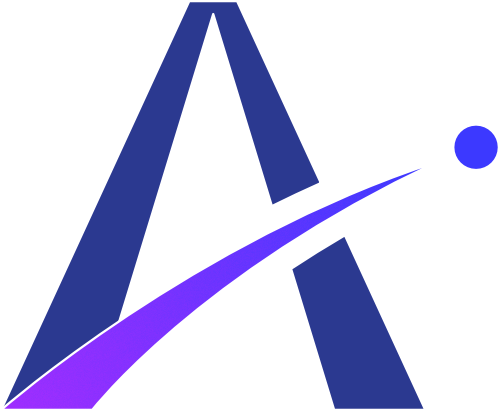
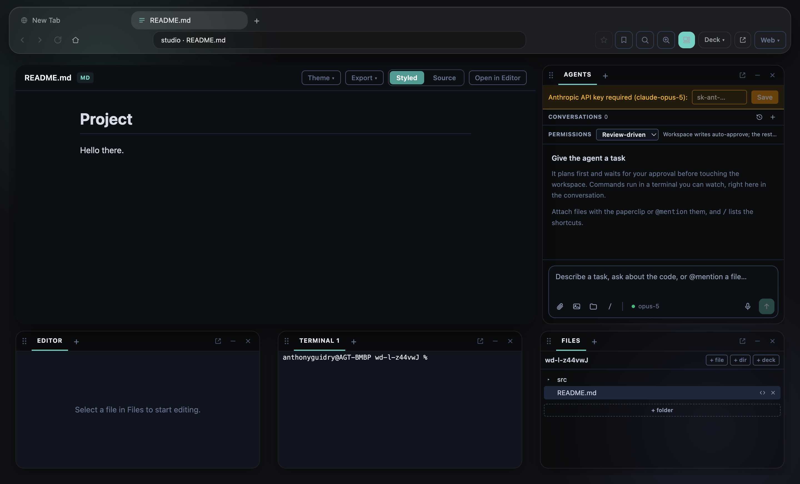

<p align="center">
  
</p>

<h1 align="center">Arcwel WebDeck</h1>

<p align="center"><strong>A browser that builds.</strong><br />
Browse the web full-screen. Press <kbd>⌘D</kbd> and a full IDE slides in around the page you're already looking at.</p>

---

## Why WebDeck exists

Every IDE eventually grows a browser, and it's always the worst browser you own — a preview pane with no tabs, no extensions, no devtools worth the name. Every browser eventually grows developer tools, and they stop at inspecting someone else's code.

WebDeck starts from the other end. It **is** a real Chromium browser — tabs, extensions, downloads, permissions, devtools. Then, when you need to build something, the **Dev Deck** slides in around the page: editor, terminal, files, source control, debugger, and an agent. Hit <kbd>⌘D</kbd> again and it's a browser again.

That ordering matters for the work people actually do now. You're reading docs, you try something, you check the result in the same window, an agent runs the test suite while you keep reading. The page never becomes a second-class citizen inside a tool that only really cares about files.

<p align="center">
  
</p>

## What's in it

### A real browser, not a preview pane

Chromium via Electron's `WebContentsView`, with the chrome a browser is supposed to have. Tabs sit inline with the window's traffic lights and shrink to fit; the address bar is centred with the bookmark star leading it and zoom on the right. There's a **native application menu** (File / Edit / View / History / Window / Help) wired to real shortcuts, a **right-click context menu** on every page (open/copy link and image, cut/copy/paste, search the selection, inspect), and the everyday essentials: back/forward/reload, **find in page**, **zoom** (⌘0 restores 100%), **print**, **new window**, **reopen closed tab**, per-tab **devtools**, downloads with progress, and site permission prompts.

**Split view** splits the *page* — two live tabs share the stage with a draggable divider — separate from the Dev Deck. A **favourites bar** is summoned rather than permanent, and can be locked open.

**Profiles** work like Chrome's people: each is an isolated, persistent session with its own cookies and logins, so you can stay signed into different Google (or any) accounts side by side. Switch them from the avatar beside the Deck button; the browser presents a real Chrome user-agent so provider sign-in flows accept it.

Unpacked Chrome extensions (MV3) load from the browser **⋮** menu. There's also an **embed proxy** for the one thing that always breaks local development: sites that refuse to be framed. Toggle it and `X-Frame-Options` plus the `frame-ancestors` CSP directive are stripped — but only for `localhost` and `127.0.0.1`, off by default, never persisted, with an amber indicator while it's live.

### Settings that belong to the app

Settings open as their own surface over the page — not a Dev Deck block — with four panels beyond the editor's own configuration: **Application** (hardware acceleration, tab restore, permission prompts, spell-check, Do-Not-Track, download location, clear browsing data), **AI** (provider API keys held in the OS keychain via `safeStorage`, never exposed to the page), **Colours** (a full RGBA editor for every colour the app paints), and the VS Code **Editor** / **Keybindings** documents.

### The Dev Deck

<kbd>⌘D</kbd> retreats the page into a spotlit frame and brings in your blocks. Every block is a peer: drag them into stacks, split them out, float one into its own OS window, or collapse it to the rail. Layouts persist per project, and there are presets for Browsing, Building and Debugging.

Blocks: **Editor**, **Files**, **Terminal**, **Agent**, **Source Control**, **Debug**, **Tasks**, **Search**, **Preview**, **Settings**, **Logs**.

### An agent that shows its work

The agent plans first, and the plan is editable before you approve it. Then it executes — and you watch it happen: commands run in **live terminals inside the conversation**, file edits come with before/after diffs, and browser actions drive real tabs you can see.

The composer is what you'd expect from a modern assistant: attachments, `@mention` to pull in workspace files, `/` commands, voice input, model picker. Conversations can be renamed, branched from any turn, exported, or handed back to the composer to edit and resend.

**Permissions are the point.** A policy engine sits between the agent and anything irreversible, in four modes from *Secure* (ask about everything) to *Agent* (run freely). Prompts appear inline, exactly where the agent is asking. Every decision is written to an audit log.

### A genuine IDE underneath

The editor isn't Monaco-in-a-box — it runs on **VS Code's own service layer**, so configuration, keybindings, themes, TextMate grammars and quick-access are the real ones.

- **Language intelligence** over LSP: completion, go-to-definition, find-references, rename, hover, diagnostics and code actions.
- **Debugging** with Microsoft's js-debug — the same adapter VS Code uses. Click the gutter, hit Debug, get breakpoints, stepping, call stack, variables and watch, with source maps and TypeScript.
- **Source control**: staged and unstaged changes, stage/unstage, commit, branch switching, and side-by-side diffs.
- **Tasks** from `package.json` and `tasks.json`, where the output becomes editor diagnostics — a build error lands as a squiggle on the line that caused it.
- **Settings** in real `settings.json` and `keybindings.json`, user and per-workspace, and you can import your existing VS Code config.

### Document Studio

Markdown, JSON, YAML, CSV and TOML render as styled documents in the browser rather than raw text — with Mermaid diagrams, math, and a one-click toggle back to source. `.slides.md` files become Reveal.js decks. Export to HTML or PDF.

## Safety

WebDeck runs an autonomous agent with filesystem and shell access, so the boundaries are explicit and documented in [`SECURITY.md`](SECURITY.md):

- The renderer is sandboxed with context isolation; a single typed bridge is the only way in.
- Every path is checked against the folders you've opened. Additional folders are granted through a picker, apply for that session only, and are never restored silently on launch.
- The embed proxy is localhost-only and off by default.
- Browser extensions load into the browser's own session, never the shell.

## Getting started

```bash
cd app
npm ci
npm run dev
```

Open a project folder, browse to something, and press <kbd>⌘D</kbd>.

To give the agent a task you'll need an Anthropic API key. Add it in **Settings → AI**, where it's encrypted into the OS keychain (Keychain / libsecret / DPAPI) rather than written as plaintext — or set `ANTHROPIC_API_KEY`. Keys for OpenAI and Gemini can be stored the same way.

Verify a build the way CI does:

```bash
npm run lint && npm run typecheck && npm run build && node scripts/smoke.mjs
```

The smoke test drives the real application end to end — browser, deck, editor, terminal, language server, debugger, source control, tasks and agent — and is the check that matters before a push.

## Project map

| File | What it holds |
| :-- | :-- |
| [`PRD.md`](PRD.md) | Product requirements and the technology decisions |
| [`TASKS.md`](TASKS.md) | The phased build plan with live status |
| [`DESIGN.md`](DESIGN.md) | The Dev Deck's design spec and motion |
| [`IDE_FOUNDATION.md`](IDE_FOUNDATION.md) | Why the IDE is built on VS Code's services rather than a fork |
| [`SECURITY.md`](SECURITY.md) | Trust boundaries, the agent's limits, residual risks |
| [`RESOURCES.md`](RESOURCES.md) | Every library and technique, with licences |
| `app/` | The application — Electron, React, TypeScript, Tailwind |

## Status

Pre-release, and honest about it. The browser, the Dev Deck, Document Studio, the agent runtime with its permission engine, and the IDE layer (language intelligence, debugging, source control, tasks, settings) are built and covered by the end-to-end smoke test.

**Next:** packaged installers. **Deferred to a future release:** VS Code *editor* extensions from Open VSX — the sandbox they need doesn't hold on the current renderer, and the reasoning is written up in [`SECURITY.md`](SECURITY.md). Browser extensions are unaffected and work today.

---

<p align="center"><sub>An <strong>Arcwel</strong> project · MIT licensed</sub></p>
