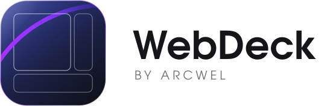
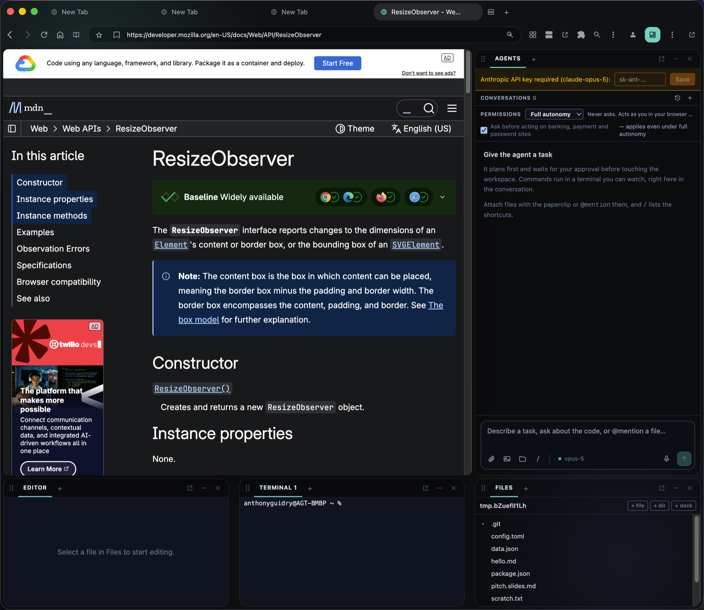
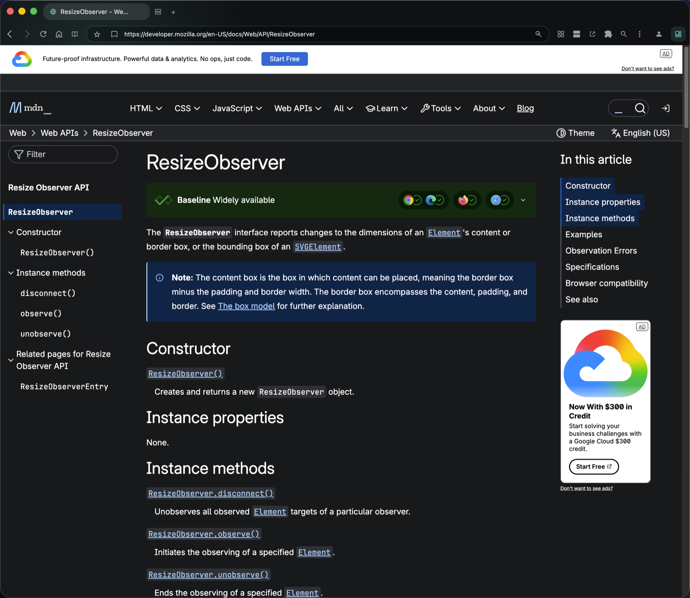
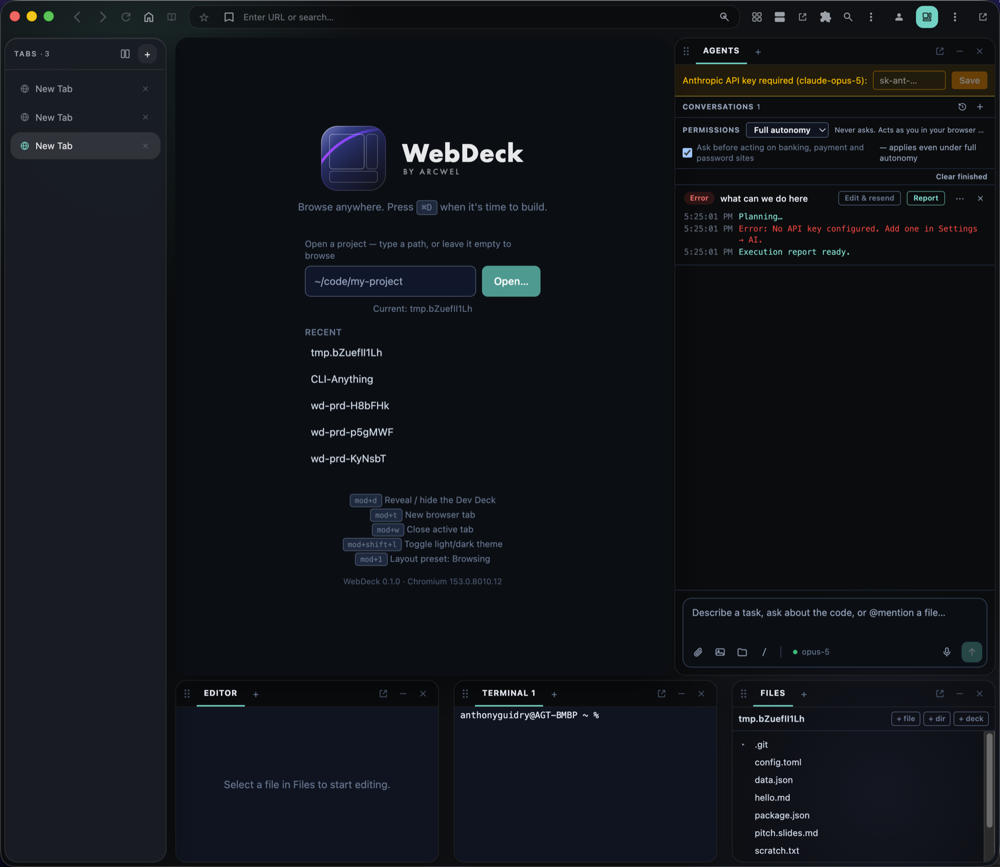
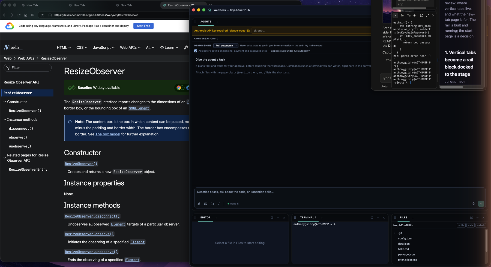
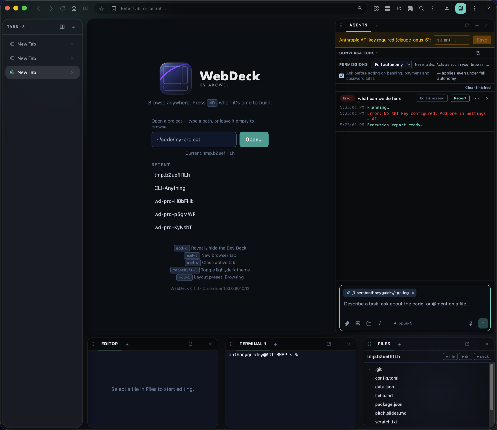

<p align="center">
  <picture>
    <source media="(prefers-color-scheme: dark)" srcset="assets/webdeck-lockup-dark.svg" />
    
  </picture>
</p>

<h1 align="center">Arcwel WebDeck</h1>

<p align="center"><strong>A browser that builds.</strong><br />
A real Chromium browser. Press <kbd>⌘D</kbd> and a full IDE and an agent slide in around the page you're already looking at.</p>

<p align="center">
  <a href="#install">Install</a> ·
  <a href="#what-you-get">Features</a> ·
  <a href="docs/getting-started.md">Getting started</a> ·
  <a href="#build-from-source">Build from source</a> ·
  <a href="#documentation">Documentation</a>
</p>

<p align="center">
  
</p>

---

## Why WebDeck

Every IDE eventually grows a browser, and it is always the worst browser you own: a preview pane with no tabs, no extensions, no devtools worth the name. Every browser eventually grows developer tools, and they stop at inspecting someone else's code.

WebDeck starts from the other end. It **is** Chromium, a fork of the real thing, with tabs, extensions, profiles, downloads, permissions and devtools. When you need to build, the **Dev Deck** slides in around the page: editor, terminal, files, source control, debugger, tasks, notebooks, and an agent that can drive the tabs you are looking at. Press <kbd>⌘D</kbd> again and it is a browser again.

Three things follow from that ordering:

- **The page is never second-class.** Read the docs, try the thing, check the result, all in one window. The agent verifies its work in the same browser you use, logged in as you.
- **The agent shows its work.** It plans first, you approve, and then every command runs in a live terminal inside the conversation, every edit ships a diff, and every browser action happens in a tab you can see. A policy engine gates anything irreversible.
- **The IDE is real.** The editor runs on VS Code's own service layer: your settings, keybindings, themes and extensions from Open VSX, with language intelligence over LSP and debugging over DAP.

## What you get

### A real browser

- Chromium M153, branded and built as Arcwel WebDeck. Tabs sit in the title bar, inline with the traffic lights; the toolbar carries the address bar, bookmarks, extensions and profile.
- **Tab groups, drag-to-reorder, tab search, split view, Picture-in-Picture, Reader Mode, find in page, zoom, print, per-tab DevTools.**
- **Vertical tabs** as a rail block docked beside the page, with groups as sections.
- Chromium **profiles**, Google sign-in, and the real `chrome://settings`, `chrome://extensions` and `chrome://history`.
- **Extensions** from the Chrome Web Store, per profile.
- **Ad and tracker blocking** with a live blocked count, third-party cookie controls, Do Not Track, HTTPS-Only mode.
- A summonable **favourites bar** that floats above the page and can be pinned.

### The Dev Deck

- <kbd>⌘D</kbd> retreats the page into a spotlit stage and docks your blocks around it: a right column, a bottom dock, a left column and a collapsed rail.
- Every block is a peer: drag into stacks, split out, **float into its own window**, or **detach the whole Deck into a second window**. Blocks fit their zone or become a tab in a stack; they never overlap.
- Layouts persist per project, with **Browsing**, **Building** and **Debugging** presets.
- Blocks: **Agent · Editor · Files · Terminal · Source Control · Git Graph · Debug · Tasks · Search · Preview · Notebook · REST client · Database · Page Assistant · Extensions · Settings**, plus any **extension view** as its own block.

### An agent that acts as you

- Plan → approve → execute → verify. The plan is editable before anything runs.
- Commands run in **live terminals inside the transcript**; file edits come with before/after diffs; browser actions drive real tabs in your session over an in-process DevTools channel, never a debugging port.
- **Agent Vision**: the agent reads the page, the console and the network of the tabs it opened.
- Composer with **attachments** from the native file panel, `@mention` for workspace files, `/` commands, voice input, and a model picker (Anthropic, OpenAI, Gemini).
- **Permission modes** from Secure (ask about everything) to Agent (run freely), per-site permissions, inline prompts, and an audit log. The policy gate fails closed.
- Conversations rename, branch from any turn, export, and hand back to the composer.

### A genuine IDE

- Editor on **VS Code's service layer**: real `settings.json` and `keybindings.json`, themes, TextMate grammars, quick-access, breadcrumbs, outline, minimap.
- **Extensions from Open VSX** run in the web extension host; each contributed view becomes a Deck block.
- **Language intelligence** over LSP: completion, go-to-definition, references, rename, hover, diagnostics, code actions. Servers ship inside the core for TypeScript and JavaScript (typescript-language-server), Python (pyright) and Rust (rust-analyzer); Go uses your `gopls`. Adding one is documented in [`app/docs/LANGUAGE_SUPPORT.md`](app/docs/LANGUAGE_SUPPORT.md).
- **Debugging** with Microsoft's js-debug: breakpoints, stepping, call stack, variables, watch, source maps.
- **Source control**: status, staged and unstaged diffs, stage, commit, branches.
- **Tasks** with problem matchers, so a build error lands as a squiggle on the line that caused it.
- **Terminal** on node-pty, **multi-root workspaces**, workspace search, dev-server preview.

### Document Studio

Markdown, JSON, YAML, CSV and TOML render as styled documents with Mermaid diagrams and math, a one-click toggle to source, and export to HTML or PDF. `.slides.md` files become Reveal.js decks.

### Settings and sync

Settings open as their own surface: Application, AI keys (held in the OS keychain, or read from your password manager so WebDeck stores nothing), Colours (every colour the app paints), Browser privacy, and the VS Code Editor and Keybindings documents. **WebDeck Sync** keeps settings, policy, model and theme identical across machines through a local-first file, with no account and no server.

### Built to be trusted

- `chrome://webdeck` is a privileged WebUI page under Chromium's process sandbox and full site isolation; `verify:hardening` measures both on the running binary.
- The page reaches the core only over a loopback WebSocket with a per-boot token; its CSP allows no remote origin, no eval, no inline script.
- The agent's file tools are pinned to the folders you opened, and its browsing is limited to `http` and `https`.
- Every trust boundary and residual risk is written down in [`SECURITY.md`](SECURITY.md).

## Screenshots

| | |
| :-- | :-- |
|  |  |
| Browsing full-screen | Vertical tabs as a rail block |
|  |  |
| The Deck in its own window | Attaching files to the agent |

## Install

**Requirements:** macOS 13 or later on Apple Silicon.

1. Download `Arcwel-WebDeck-<version>-arm64.dmg` from the [releases](https://github.com/arcwel/WebDeck/releases), or build it (below).
2. Open the DMG and drag **Arcwel WebDeck** to Applications.
3. First launch of a build that is not notarized: right-click the app, choose **Open**, and confirm. After that it opens normally.

The agent needs a provider key. **Settings → AI** stores it in the macOS Keychain, or points WebDeck at your password manager (`op read`, `pass show`, `security find-generic-password`, `vault read`). `ANTHROPIC_API_KEY` in the environment also works.

Then read [Getting Started](docs/getting-started.md): the first five minutes, the blocks, and the shortcuts.

## Build from source

WebDeck is two builds: the **core** (a Node service compiled to a single executable) and the **browser** (a Chromium checkout with this repository's patches applied). Full detail, including signing and notarization, is in [`chromium/RELEASING.md`](chromium/RELEASING.md).

**Prerequisites:** Xcode with command-line tools, depot_tools, a Chromium checkout at the base pinned in [`chromium/fork.json`](chromium/fork.json) (about 100 GB and a few hours the first time), Node 20+.

```bash
# 1. The core
cd app && npm ci && npm run build:core

# 2. The browser: apply the patch set to the checkout, then configure and build
node scripts/verify-patches.mjs                     # the repo describes the fork
autoninja -C out/webdeck-release chrome/browser/ui/webui/webdeck:mojo_bindings
npm run pack:webui:release                          # WebUI + Mojo bindings for THIS out dir
autoninja -C out/webdeck-release chrome -j 6

# 3. Put the core in the bundle, prove it, package
node scripts/install-core.mjs --app "out/webdeck-release/Arcwel WebDeck.app"
node scripts/verify-deliverable.mjs --app "out/webdeck-release/Arcwel WebDeck.app"
node scripts/package-fork.mjs --build-dir out/webdeck-release --out ../dist
```

### The development loop

| Change | Rebuild |
| :-- | :-- |
| WebUI (React, `app/src/renderer`, `app/src/webui`) | `npm run pack:webui` (component build) or `pack:webui:release`, then `autoninja … chrome` relinks in about three minutes |
| Core (`app/src/core`) | `npm run build:core && node scripts/install-core.mjs --app <.app>`; no browser rebuild |
| Chromium patches (`chromium/patches`) | Edit the checkout, `git diff --binary > chromium/patches/upstream-edits.diff`, `npm run verify:patches` |
| A `.mojom` change | Build `…:mojo_bindings` first, then pack; packing refuses bindings that do not match the out dir |

Verification gates, in the order CI runs them:

```bash
npm run lint && npm run typecheck && npm test        # the app
npm run verify:patches                               # the repo reproduces the fork
npm run verify:fork -- --browser <binary>            # the shell boots, opens a project, exports
npm run verify:hardening -- --browser <binary> --release   # sandbox, site isolation, CSP, gn config, signature
node scripts/verify-deliverable.mjs --app <.app>     # runs on a machine that never saw the build tree
```

Developer builds are ad-hoc signed. With the `webdeck_dev_keychain` gn arg on, such a build keeps its cookie encryption key in the profile instead of raising the macOS Keychain prompt on every rebuild; a Developer ID build never takes that path. See [`chromium/RELEASING.md`](chromium/RELEASING.md).

## How it fits together

```
┌──────────────────────────── Arcwel WebDeck.app ────────────────────────────┐
│  Chromium (M153 + chromium/patches)                                        │
│   ├─ chrome://webdeck  ── the WebUI shell: tabs, toolbar, Deck, blocks     │
│   │      │  Mojo (Shell, AgentTabs): stage bounds, tabs, windows, pickers  │
│   ├─ the staged tab ── the real page, positioned into the shell's stage    │
│   └─ webdeck-core  ── Node single-executable, spawned by the browser       │
│           loopback WebSocket + per-boot token                              │
│           files · terminals · LSP · DAP · git · tasks · agent · policy     │
└────────────────────────────────────────────────────────────────────────────┘
```

The shell page owns the window and streams the stage rectangle to the browser; Chromium positions the active tab into it. Deck and float windows are ordinary browser windows whose shell page carries a role. The core is the same on every host, so the UI never knows which process answered.

## Repository map

| Path | What it holds |
| :-- | :-- |
| `app/src/renderer` | The shell UI: React, TypeScript, Tailwind. Blocks, Deck, tab strip, composer |
| `app/src/webui` | The `chrome://webdeck` entry: Mojo bridge, pickers, exports, window sync |
| `app/src/core` | `webdeck-core`: the domains (fs, terminal, lsp, debug, git, tasks, agent, policy, workspace) and the transport |
| `app/scripts` | Build, pack, verify and package scripts |
| `chromium/` | The fork: `fork.json` pin, `patches/` (new file trees plus `upstream-edits.diff`), build and release docs |
| `docs/` | User guides |
| `design/` | Design canvases and review pages |

## Documentation

| Document | Read it when |
| :-- | :-- |
| [Getting Started](docs/getting-started.md) | You have just installed it |
| [Agent Workflows](docs/agent-workflows.md) · [Permission Modes](docs/permission-modes.md) | You are giving the agent work |
| [Document Studio](docs/document-studio.md) · [Settings Sync](docs/settings-sync.md) | You want the rendered docs or the same setup on two machines |
| [`PRD.md`](PRD.md) · [`ROADMAP.md`](ROADMAP.md) | You want to know what it is for and where it is going |
| [`DESIGN.md`](DESIGN.md) | You are changing how the Deck looks or moves |
| [`IDE_FOUNDATION.md`](IDE_FOUNDATION.md) | You are touching the editor, LSP or DAP |
| [`SECURITY.md`](SECURITY.md) | You are touching the agent, the policy gate or a process boundary |
| [`chromium/README.md`](chromium/README.md) · [`chromium/SHELL_ARCHITECTURE.md`](chromium/SHELL_ARCHITECTURE.md) | You are working on the fork or the Shell interface |
| [`chromium/RELEASING.md`](chromium/RELEASING.md) · [`chromium/SHIPPABLE.md`](chromium/SHIPPABLE.md) | You are cutting a release |
| [`CHANGELOG.md`](CHANGELOG.md) | You want to know what changed |

## Contributing

- Conventional commits (`feat:`, `fix:`, `docs:`, `refactor:`, `security:`). Commit from the repository root.
- Before a commit: `npm run lint && npm run typecheck && npm test` in `app/`, and `npm run verify:patches` when the fork changed.
- UI work is reviewed on the real window, with screenshots, before it is called done.
- Design changes go through a review page first (see `design/`).

## Status

Pre-release. The browser, the Dev Deck, the agent with its permission engine, the IDE layer and Document Studio are built, verified on the real window, and shipped as a release candidate DMG. Signed distribution needs an Apple Developer ID and is documented, not yet automated.

## License

Arcwel WebDeck is [MIT licensed](LICENSE). It is a derivative of Chromium (BSD-3-Clause) and embeds the Node.js runtime (MIT); the inventory of bundled components and their licences is in [`THIRD_PARTY_LICENSES.md`](THIRD_PARTY_LICENSES.md) and under **Settings → About**. The browser's own components are credited at `chrome://credits`.

---

<p align="center"><sub>An <strong>Arcwel</strong> project · MIT licensed</sub></p>
